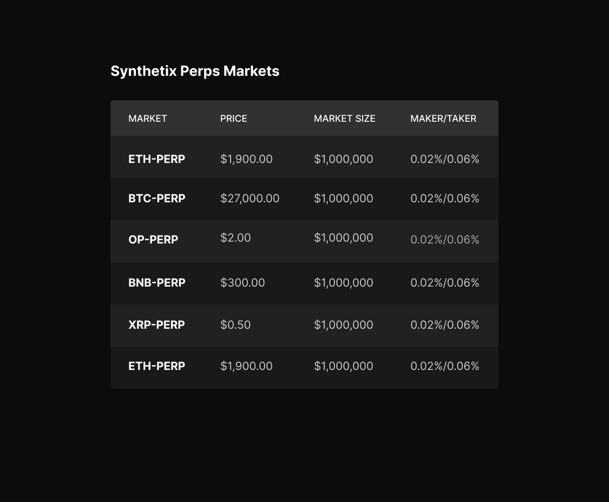

## Getting Started

Setup:

`npm install`

Run the dev server:

```bash
npm run dev
```

Open [http://localhost:3000](http://localhost:3000) with your browser to see the result.

## Development task

Display a list of Synthetix perps markets.

- Pull the markets information from the Optimism PerpsV2MarketData contract at address: `0x340B5d664834113735730Ad4aFb3760219Ad9112`
- Render a list of all the perps markets
- Display the market name, market size in $, current price and maker / taker fee (delayed off chain)
- The list of markets should be ordered by market size
- You should make use of styled-components

[Figma File](https://www.figma.com/file/zxzYWNqKSnjGSnXd5tYIDN/Markets-List?type=design&node-id=0%3A1&t=iM2wd9Y4mCMPJ7H7-1)


